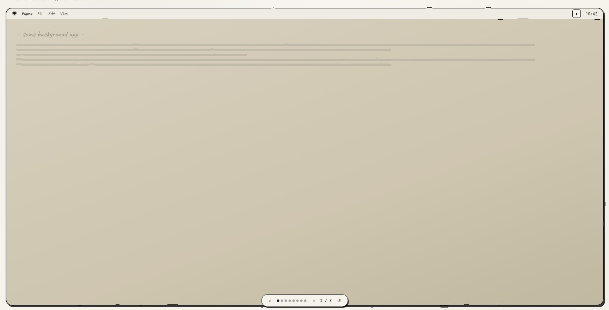
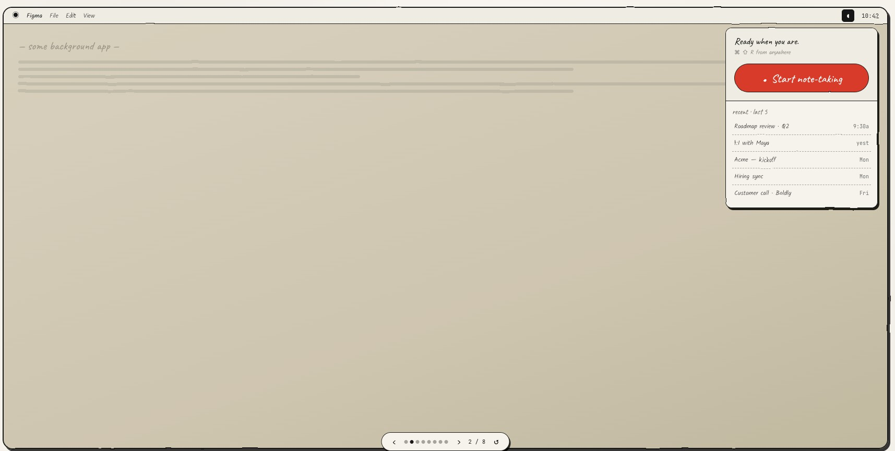
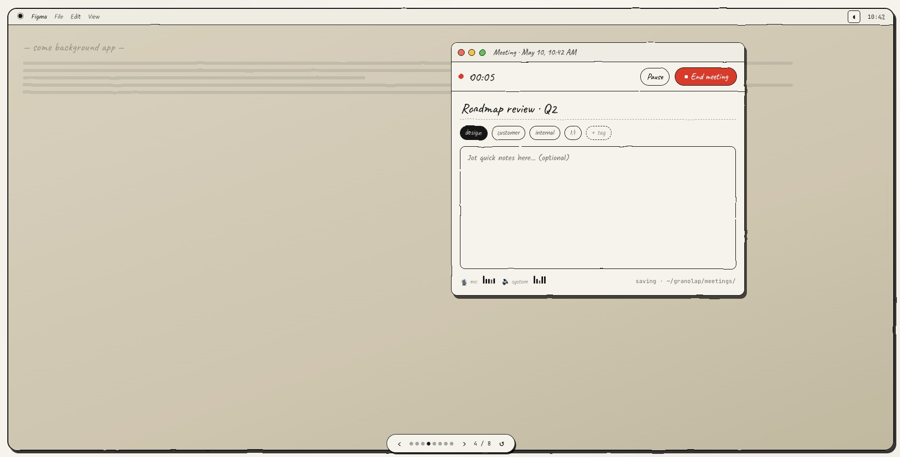
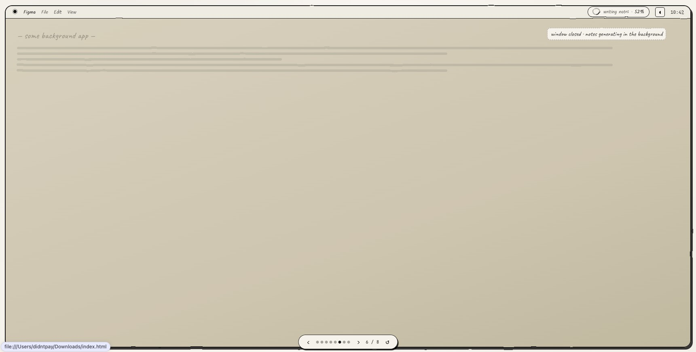
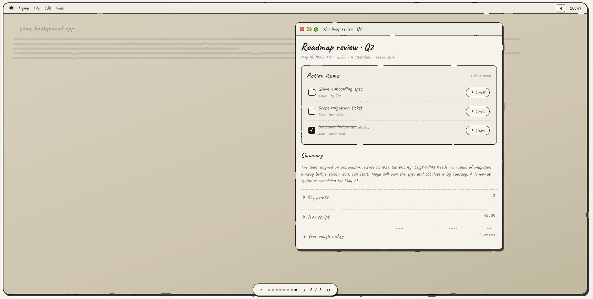

# Granolap — MVP Plan

A local-first, Granola-style meeting notes app for macOS. Manual mode: user clicks a button to start recording; the app transcribes locally and synthesizes notes via Claude.

---

## Product scope (MVP)

- **Platform**: macOS 14.0+
- **Mode**: Manual only — user clicks "Start note-taking" to begin
- **In-meeting UI**: tiny floating recorder (timer + pause + stop). No typing, no live transcript.
- **Generation UX**: ambient — meeting window closes when user clicks End; progress shown as a menu-bar pill; macOS notification fires when notes are ready
- **Notes layout**: **actions-first** (action items at top, then summary, then collapsible key points + transcript)
- **Storage**: fully local (audio + transcript + notes)
- **Network**: only outbound call is Claude API for note synthesis
- **Global shortcut**: `⌘⇧R` opens the dropdown / starts recording from anywhere

### Out of scope for MVP

- Calendar integration / auto-detection
- Sharing, collaboration, cloud sync
- Live transcript during meeting
- User typing during meeting (no title input, tags, or jot textarea)
- Task-system integrations (Linear/Asana/etc. chips on action items)
- Custom templates (single hardcoded template)
- Speaker diarization
- Editing notes after generation (read-only, but data model ready for it)
- Code-signing / notarization (unsigned dev builds)

---

## Visual theme

Paper-ish aesthetic, loosely modeled on the lo-fi prototype:

- **Background**: warm cream (`#faf9f5`)
- **Headings**: handwritten-style font (Caveat or similar — exact font not load-bearing)
- **Metadata / counters**: monospace
- **Borders**: thin, slightly irregular ("hand-drawn") feel; dashed for collapsible section dividers
- **Accents**: a single warm-red dot for "recording" state
- **Hand-drawn feel in SwiftUI**: SVG `feTurbulence` doesn't port directly; use `Canvas` with a subtle stroke jitter, or ship pre-rendered border assets. Spike during scaffolding to find the cheapest convincing approximation.

---

## Design reference

These are screenshots from the lo-fi clickable prototype. They establish the visual feel and the rough flow. **Note**: some prototype details (typing during the meeting, the Linear chip on action items) are intentionally cut from MVP — see "Out of scope" above and the Decisions log below.

### Idle — menu bar


### Dropdown — "Ready when you are"


### Meeting window


> ⚠ For MVP, drop the title input, tag chips, and "Jot quick notes" textarea. Keep timer, Pause, End meeting, and the mic/system audio meters.

### Generating — ambient menubar pill


### Notes window — actions-first


> ⚠ For MVP, hide the `→ Linear` chips. The `externalRef` field is reserved in the data model for future task-system sync.

---

## Core flows

### Flow 1 — Launch
- Menu bar icon only; no dock window
- Click icon (or press `⌘⇧R`) → dropdown opens

### Flow 2 — Dropdown
- "Ready when you are." hero + `⌘⇧R` hint
- **Start note-taking** button
- **Recent · last 5** meetings list (click to open notes)

### Flow 3 — First-run permissions (one-time)
- Two click-to-grant rows: **Microphone** and **Screen & system audio**
- Both must be granted before **Start meeting →** enables
- "Not now" returns to idle
- After both granted (once), this screen is skipped on future runs

### Flow 4 — Start meeting
1. Click **Start note-taking** (or after permissions complete)
2. Floating recorder panel appears (small, ~280×120, always on top, draggable):
   ```
   ●━━━━━━━━━━━━━━━━━━━━━━━━━━━━━
    ● 00:00         [Pause]  [■ End]
    🎙 ▮▮▮▯▯   🔊 ▮▮▮▮▯
   ```
   - Red traffic-light dot = End meeting
   - Yellow traffic-light dot = Minimize (Flow 5)
   - Live audio meters for mic + system audio
3. Recording starts immediately (system audio + mic, mixed)

### Flow 5 — Minimized (live menu-bar pill)
- Yellow traffic-light tucks the window away
- Menu bar shows a live pill: `● 12:34` with elapsed time updating each second
- Click pill → re-opens the floating recorder
- Click pill's inline **End** affordance → goes straight to Flow 6
- Recording continues uninterrupted

### Flow 6 — End → ambient generation
1. User clicks **End** (from recorder or pill)
2. Recorder window **closes** — does not block the user
3. Menu bar shows an ambient progress pill cycling through stages:
   - `transcribing · 12%`
   - `writing notes · 78%`
   - `finishing up · 99%`
4. When complete, a **macOS notification** fires: "Notes for *<title>* are ready · N action items"
5. The progress pill becomes a brief `✓ notes ready` pill, then clears

### Flow 7 — Notes window (actions-first)
Opens on notification click, or from menu-bar dropdown:

```
┌─────────────────────────────────────────┐
│ ○ ○ ○   Roadmap review · Q2             │
├─────────────────────────────────────────┤
│ Roadmap review · Q2                     │  (handwritten)
│ May 10, 10:42 AM · 42:18 · 3 to do      │
│                                         │
│ Action items                  1 of 3    │
│  ○  Share onboarding spec               │
│     Maya · by Tue                       │
│  ○  Scope migration ticket              │
│     Ravi · this sprint                  │
│  ✓  Schedule follow-up review           │
│     auto · invite sent                  │
│                                         │
│ Summary                                 │
│ The team aligned on onboarding…         │
│                                         │
│ ▸ Key points                       3    │
│ ▸ Transcript                  42:18     │
└─────────────────────────────────────────┘
```

- **Actions checkable** in UI but stays local — no external sync in MVP
- Summary visible by default
- Key points + transcript collapsed by default
- Read-only otherwise

### Flow 8 — Past meetings
- Menu bar dropdown → click any recent → opens its notes window
- Read-only in MVP

### Flow 9 — Pause
- Pause **stops capture** (creates a gap in audio); resume starts a new segment
- Segments concatenated on End

---

## Architecture

```
┌─ Swift macOS app (menu bar) ─────────────────┐
│                                              │
│  Menu bar icon + global ⌘⇧R                  │
│   └─ dropdown (hero + recents)               │
│                                              │
│  Floating recorder (~280×120)                │
│   ● 00:42  [Pause] [End]                     │
│   🎙 meter   🔊 meter                        │
│                                              │
│  Menu-bar pill (minimized)                   │
│   ● 12:34   [End]                            │
│                                              │
│  Menu-bar pill (generating)                  │
│   ◌ transcribing · 47%                       │
│                                              │
│  macOS notification → opens Notes window     │
│                                              │
│  Notes window (actions-first, read-only)     │
│                                              │
└──────────────┬───────────────────────────────┘
               │
   ┌───────────┼────────────┐
   ▼           ▼            ▼
ScreenCapture  AVAudio    WhisperKit
   Kit         Engine     (local model)
(system audio) (mic)            │
   └───┬───────┘                │
       ▼                        ▼
   mixed audio.m4a        transcript.json
                                │
                                ▼
                       Claude API (direct from app)
                                │
                                ▼
                          notes.json
                                │
                                ▼
              SQLite + filesystem (local)
```

No backend server. Swift app calls Claude API directly using the user's API key (stored in Keychain).

---

## Tech stack

| Layer | Choice | Notes |
|---|---|---|
| Shell | Swift + SwiftUI | Pure native; no WKWebView |
| System audio | ScreenCaptureKit (`SCStream`) | macOS 14+ API |
| Mic capture | AVAudioEngine | |
| Audio mixing/encode | AVAudioEngine → AVAudioFile | m4a output |
| Transcription | [WhisperKit](https://github.com/argmaxinc/WhisperKit) | Swift-native, CoreML/MLX, Neural Engine |
| Whisper model | `small.en` (~466MB) | Downloaded on first launch |
| LLM | Claude Sonnet 4.6 via Anthropic API | Direct from Swift, structured output |
| Notifications | UserNotifications framework | Native macOS notification on done |
| Global shortcut | [KeyboardShortcuts](https://github.com/sindresorhus/KeyboardShortcuts) | `⌘⇧R` registration |
| Local DB | SQLite via GRDB.swift | Index of meetings |
| API key storage | macOS Keychain | User-provided |

---

## Extensibility (baked into MVP)

Even though these aren't shipping in MVP, the architecture leaves clean seams for them:

- **Editing notes later** — notes stored as structured JSON (title, summary, keyPoints, actionItems), not parsed markdown. When editing lands, mutate fields.
- **Diarization later** — transcript schema is `segments: [{ start, end, text, speakerId? }]` with `speakerId` nullable. Drop in diarization later by populating the field.
- **Pluggable transcription** — `Transcriber` protocol. Whisper today; whisperX, cloud STT, etc. behind same interface.
- **Pluggable LLM** — `NotesGenerator` protocol. Claude today; on-device LLM, OpenAI, etc. later.
- **Pluggable audio sink** — single mixed file today; per-source files later (enables diarization across system audio vs mic).
- **Task-system integrations** — action items have an optional `externalRef` field reserved for future Linear/Asana sync.

---

## Data model

### Filesystem layout

```
~/Library/Application Support/Granolap/
├── meetings/
│   └── <uuid>/
│       ├── audio.m4a           # mixed (system + mic)
│       ├── transcript.json     # WhisperKit output + timestamps
│       └── notes.json          # Claude output (structured)
└── db.sqlite                   # index for fast listing
```

### SQLite schema (sketch)

```sql
CREATE TABLE meetings (
  id           TEXT PRIMARY KEY,
  title        TEXT NOT NULL,
  started_at   INTEGER NOT NULL,    -- unix seconds
  duration_s   INTEGER NOT NULL,
  audio_path   TEXT NOT NULL,
  transcript_path TEXT NOT NULL,
  notes_path   TEXT NOT NULL,
  created_at   INTEGER NOT NULL,
  updated_at   INTEGER NOT NULL
);
```

### Transcript JSON

```json
{
  "language": "en",
  "segments": [
    { "start": 0.0, "end": 3.2, "text": "Hey, thanks for joining.", "speakerId": null }
  ]
}
```

### Notes JSON

```json
{
  "title": "Q2 roadmap sync",
  "summary": "Discussed shipping the notes editor and pushing diarization to v1.2.",
  "keyPoints": ["Editor blocked on schema migration", "..."],
  "actionItems": [
    {
      "text": "Spike CoreML diarization",
      "owner": "Wei",
      "due": null,
      "done": false,
      "externalRef": null
    }
  ]
}
```

`done` is local-only checkbox state in MVP. `externalRef` is reserved for future task-system sync.

---

## LLM prompt (MVP)

```
Summarize this meeting transcript. Return JSON matching the schema.

Prioritize action items — they appear first in the user's view, so extract
them carefully. Only include items that are explicitly stated as something
to do; do not invent.

- title: under 60 chars, descriptive of the meeting's main topic
- actionItems: explicit todos; include owner (person's name) and due (e.g. "by Tue", "this sprint") if stated; leave null if not
- summary: 2-3 sentences of what was discussed
- keyPoints: bullet-worthy discussion points (not action items)

Transcript:
{transcript}
```

Use Claude Sonnet 4.6 with structured output (JSON schema enforcement) so the Swift app gets typed fields directly.

---

## Project layout

```
Granolap/
├── Granolap.xcodeproj
├── Granolap/
│   ├── App/                    # entry point, menu bar, global shortcut
│   ├── Features/
│   │   ├── Dropdown/           # menu-bar dropdown (hero + recents)
│   │   ├── Permissions/        # first-run permissions screen
│   │   ├── Recorder/           # floating panel + minimized pill
│   │   ├── Generation/         # menu-bar progress pill + notification
│   │   ├── Notes/              # notes window (actions-first viewer)
│   │   └── Settings/           # API key, model download
│   ├── Core/
│   │   ├── Audio/              # ScreenCaptureKit + AVAudioEngine
│   │   ├── Transcription/      # Transcriber protocol + WhisperKit impl
│   │   ├── LLM/                # NotesGenerator protocol + Claude impl
│   │   ├── Storage/            # GRDB models + filesystem
│   │   ├── Notifications/      # UserNotifications wrapper
│   │   └── Keychain/           # API key
│   ├── Theme/                  # paper colors, fonts, hand-drawn helpers
│   └── Resources/              # bundled font(s), icons
└── Packages/
    └── (SPM: WhisperKit, GRDB, KeyboardShortcuts)
```

---

## Open items / future work

### Intentional MVP divergences
- **System audio dropped from MVP** — the plan originally called for mic + system audio mixed via `SCStream`. Removed in favour of mic-only: simpler permissions story, no screen-recording prompt, and the most common use case (in-person meetings + voice calls picked up by mic) is unaffected. Reinstate behind a setting if user feedback demands it.

### Post-MVP
- **Code signing + notarization** — needed before sharing widely (requires $99/yr Apple Developer Program). Until then, peers right-click → Open to bypass Gatekeeper.
- **API key UX** — user pastes key in Settings; stored in Keychain. Later: optional proxy through own backend.
- **Editing notes** — UI + persistence on top of structured JSON model.
- **Speaker diarization** — populate `speakerId` per segment.
- **Calendar auto-detection** — Granola's headline feature; v2.
- **Custom templates** — user-defined note structures.
- **Live transcript view** — optional side panel during meeting.
- **Search across meetings** — full-text search over transcripts + notes.
- **Task-system integrations** — Linear / Asana / etc. sync via `externalRef`.

---

## Decisions log

| Decision | Choice | Why |
|---|---|---|
| Wrapper vs pure native | Pure SwiftUI | No backend, small UI surface; WKWebView buys nothing |
| Backend | None | Cloud LLM call goes direct from Swift |
| Transcription | Local (WhisperKit) | Local-first principle |
| LLM | Cloud (Claude) | Quality over local for MVP |
| API key | User-provided | Zero infra for MVP |
| In-meeting typing | None | Minimal in-meeting UI; honors user-set constraint |
| Generation UX | Ambient (window closes → menu-bar progress → notification) | Doesn't block the user; nicer flow from prototype |
| Notes layout | Actions-first | Stronger product POV than summary-first |
| Task-system chips (Linear etc.) | Hidden in MVP | Out of scope; reserved field in data model |
| Notes editing | Read-only (MVP) | Faster to ship; schema ready for editing |
| Diarization | Skipped (MVP) | Out of scope; schema ready for it |
| macOS floor | 14.0+ | Latest `SCStream` audio API, modern SwiftUI |
| Distribution | Unsigned dev builds | Hobby/dogfood phase |
| Visual theme | Paper / cream / handwritten headings | Matches prototype direction; exact font not load-bearing |
| Global shortcut | `⌘⇧R` | From prototype; speeds repeat use |
| Architecture | MVC (AppController + RecorderController + NotesController) | Cleaner separation than MVVM for this use case |
| Features folder | Renamed to `Views/` | More accurate — views contain no business logic |
| Main window | Added NavigationSplitView (sidebar + detail) | Needed a home for past meetings and notes; menu-bar-only was insufficient |
| Storage (implemented) | JSON files instead of GRDB/SQLite | No GRDB dependency to manage; JSON sufficient for MVP meeting index |
| Transcription | WhisperKit `openai_whisper-small.en` | Local, Core ML / Neural Engine. ~466MB model downloaded on first transcription with progress shown in the menu-bar pill. |
| Audio (interim) | `AVAudioRecorder` (mic only) instead of AVAudioEngine + SCStream mix | Unblocks recording pipeline; system audio is next milestone |
| Heading font | SF Pro Rounded instead of Caveat | Caveat requires bundling a TTF; SF Rounded is built-in and visually close enough for now |
